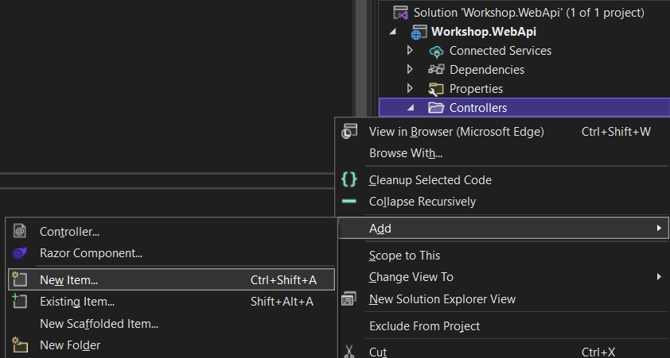
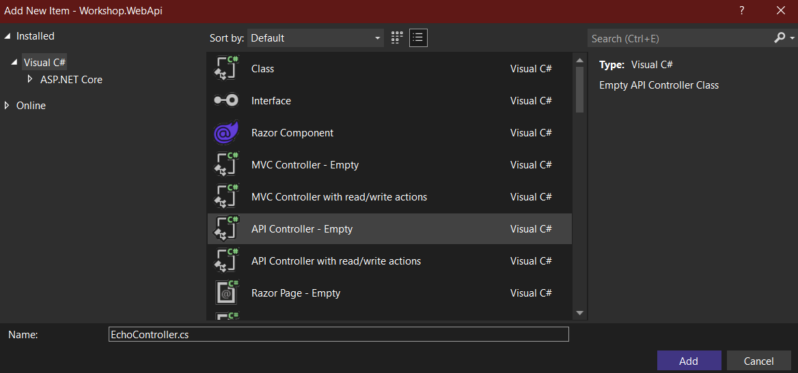

# ASP.NET Web API `C#`

In diesem Abschnitt geht es um das ASP.NET Framework welches auf .NET 5 setzt und mit C# entwickelt wird.

.NET bietet die Möglichkeit Vorlagen zu nutzen um neue Projekte zu erstellen.
Es gibt Community und Microsoft Vorlagen, für dieses Projekt nutzen wir die Microsoft Vorlage `webapi`.
In der Vorlage wird eine ASP.NET Web API Anwendung erzeugt, welche einen Wetter Endpunkt bereitstellt.
Dieser Endpunkt nimmer aus einer definierten Liste von Wetterereignissen mehrere Zufällige Werte als Antwort sowie zufällige Temperaturen für die kommenden Tage.

Themen sichtbar in der Vorlage:

- Data Transfer Object (DTO)
- Computed Properties
- OpenApi Specification (Swagger)
- Logging

## Projekt erstellen

`dotnet new webapi --name Workshop.WebApi --output Workshop.WebApi --language C# --framework net5.0`

[Weitere Informationen zu .NET Vorlagen](https://docs.microsoft.com/en-us/dotnet/core/tools/dotnet-new-sdk-templates)

Projekt local starten mit watch
`dotnet watch --project Workshop.WebApi\Workshop.WebApi.csproj`

Während des Debuggens kann man auf den Playground zugreifen und die API ausprobieren.
[OpenApi Playground](https://localhost:5001/swagger/index.html)

## API Controller erstellen

Wir erzeugen uns einen eigenen API Controller mit API Operationen.

> Für Visual Studio

1. Im Kontextmenü des `Controllers` Verzeichnis auf `Add` klicken und `New Item...` auswählen.

    > 

2. `API Controller - Emtpy` auswählen und einen Namen eingeben, muss im Format `<NAME>Controller.cs` angegeben werden. Danach mit `Add` erzeugen. In userem Beispiel nehmen wir `EchoController.cs`.

    > 

> Alternativ für Visual Studio Code eine Datei erzeugen und den folgenden Code manuell hinzufügen

Die Datei / der API Controller sollte nun folgendermaßen aussehen:

```c#
// EchoController.cs
using Microsoft.AspNetCore.Http;
using Microsoft.AspNetCore.Mvc;

namespace Workshop.WebApi.Controllers
{
    [Route("api/[controller]")]
    [ApiController]
    public class EchoController : ControllerBase
    {
    }
}
```

Nun fügen wir eine API Operation hinzu, welche eine Zeichenkette zurück gibt.

```c#
        // GET: /api/Echo/simple
        [HttpGet("simple")]
        public ActionResult<string> Get() {
            return Ok("Hallo Welt");
        }
```

`[HttpGet("simple")]` sagt dem Framework, dass die Operation bzw. die folgende Funktion auf die HTTP Methode GET hört und unter der Route `api/[controller]/simple`, welche zu `api/Echo/simple` wird, erreichbar ist.

Der Rückgabetyp `ActionResult` in der Funktionssignatur ist für das HTTP Handling vorhanden. Bei der Rückgabe der Funktion wird die Funktion `Ok` (HTTP Status Code 200) mit dem `string` Parameterwert `Hallo Welt` übergeben.

Gern per klick auf `Debug` dort auf `Start Debugging` oder `F5` im Swagger Playground die Operation ausprobieren.

Nun bauen wir eine weitere Operation, mit der wir auf Informationen aus dem HTTP Request zugreifen.
Wir wollen eine Zeichenkette aus dem Query nehmen und als Rückgabewert zurückliefern.

```c#
        // // GET: /api/Echo/parameter?msg=<value>
        [HttpGet("parameter")]
        public ActionResult<string> Parameter([FromQuery] string msg) {
            return Ok(msg);
        }
```

In der Parametern haben wir nun ein `string` mit dem Namen `msg` welcher aus dem Query kommen muss, dank dem Attribut `[FromQuery]`, Parameter können auch noch aus dem Route, Header (Key-Value) oder Body (Json) stammen.
Aufbau URL: `<PROTOCOL(HTTP|HTTPS>://<FQDN/HOSTNAME(LOCALHOST)>/<PATH/ROUTE(/api/Echo/parameter)>?<QUERY(KEY=VALUE[&])>`

Nun bauen wir eine weitere Operation, in der wir den Parameter `msg` optional machen und aus der Route erhalten. In der Funktion überprüfen wir, ob dieser mitgegeben wird, falls nicht werfen wir einen HTTP Status Code 400 - Bad Request zurück.

```c#
        // GET: /api/Echo/validate/<msg>
        [HttpGet("validate/{msg}")]
        public ActionResult<string> Validate([FromRoute] string msg = null) {
            if (string.IsNullOrWhiteSpace(msg)) {
                return BadRequest();
            }
            return Ok(msg);
        }
```

Die Funktion BadRequest erzeugt ein Objekt des Types ActionResult, welches eine HTTP Response / Antwort mit dem HTTP Status Code 400 erzeugt.

Nun erstellen wir einen neuen API Controller mit API CRUD Operationen. Als kleines Beispiel wollen wir Personen als Resource handhaben. Daher nennen wir den API Controller `PersonsController.cs`. Des Weiteren nehmen wir uns eine Klasse als Data Transfer Object (DTO). Dafür erzeugen wir einen neues Verzeichnis `Models` und dort die Datei `Person.cs`. Um es einfach zu halten nehmen wir nur einen Identifier `id` und eine Werte Eigenschaft `name`.

```c#
// Person.cs
namespace Workshop.WebApi.Models
{
    public class Person
    {
        public int Id { get; set; }
        public string Name { get; set; }
    }
}
```

Diese können wir nun im API Controller verwenden. Um die Daten zur Laufzeit zu persistieren nehmen wir uns dazu ein Dictionary. Ein Dictionary ist ein Key-Value-Speicher und ist im Namespace System.Collections.Generic zu finden damit wir also das Dictionary verwerden können, müssen wir entweder den Namespace per `using` einbinden oder den Typen voll ausschreiben `System.Collections.Generic.Dictionary`.

```c#
// PersonsController.cs
using Microsoft.AspNetCore.Http;
using Microsoft.AspNetCore.Mvc;
using System.Collections.Generic;
using Workshop.WebApi.Models;

namespace Workshop.WebApi.Controllers
{
    [Route("api/[controller]")]
    [ApiController]
    public class PersonsController : ControllerBase
    {
        private static Dictionary<int, Person> store { get; } = new Dictionary<int, Person> {
            { 1, new Person{ Id = 1, Name = "Peter Peterson" } },
            { 2, new Person{ Id = 2, Name = "Klaus Klausens" } },
            { 3, new Person{ Id = 3, Name = "Singa Singable" } },
        };
    }
}
```

Nun erstellen wir die Read (cRud - GET) Operationen, einmal einen Endpunkt für alle Personen und einen für eine Person.

```c#
        [HttpGet]
        public ActionResult<IEnumerable<Person>> GetPersons() {
            return Ok(store.Values.ToList());
        }

        [HttpGet("{id}", Name = nameof(GetPersonById))]
        public ActionResult GetPersonById(int id) {
            return Ok(store[id]);
        }
```

Bei der Create (Crud - POST) Operation überprüfen wir erstmal, ob nicht bereits ein Eintrag mit der `Id` vorhanden ist. Wenn der Zustand des Models valide ist, wird das Model dem Store hinzugefügt und eine HTTP Status Code 201 Antwort zurück gegeben. Der Status Code 201 erwartet eine Url im Header mit dem Key `location`.

```c#
        [HttpPost]
        public ActionResult PostPerson([FromBody] Person person) {
            if (store.ContainsKey(person.Id)) {
                ModelState.AddModelError(nameof(person.Id), "Resource with the id already exists");
            }
            if (ModelState.IsValid) {
                store.Add(person.Id, person);
                return CreatedAtRoute(nameof(GetPersonById), new { person.Id }, person);
            }
            return BadRequest(ModelState.ValidationState);
        }
```

Jetzt folgt die Update (crUd - PUT) Operation, zuerst schauen wir, ob ein Eintrag mit der `Id` existiert und ob der Zustand des Models valide ist. Falls alles zutrifft, wird die Person im Store aktualisiert / überschrieben. Die Antwort für eine PUT Operation ist ein Status Code 204.

```c#
        [HttpPut("{id}")]
        public ActionResult PutPerson([FromRoute] int id, [FromBody] Person person) {
            if (!store.ContainsKey(id)) { return NotFound(); }
            if (!ModelState.IsValid) { return BadRequest(ModelState.ValidationState); }
            store[id] = person;
            return NoContent();
        }
```

Bei der Delete (cruD - DELETE) Operation, überprüfen wir ebenfalls im Store ob eine Person mit der Id existiert.

```c#
        [HttpDelete("{id}")]
        public ActionResult DeletePerson([FromRoute] int id) {
            if (!store.ContainsKey(id)) { return NotFound(); }
            store.Remove(id);
            return NoContent();
        }
```

> Alternativ zum Swagger Playground kann auch der Postman genutzt werden.

## Anwendung bauen & bereitstellen

Anwendung bauen

`dotnet build --configuration Release .\Workshop.WebApi\Workshop.WebApi.csproj`

Anwendung veröffentlichen

`dotnet publish --no-build -c Release -o .\Workshop.WebApi\bin\publish .\Workshop.WebApi\Workshop.WebApi.csproj`

[Zurück zur Übersicht](README.md)
[Weiter zu Abschnitt 2 - Node.js API mit Nest.js](abschnitt-2.md)
